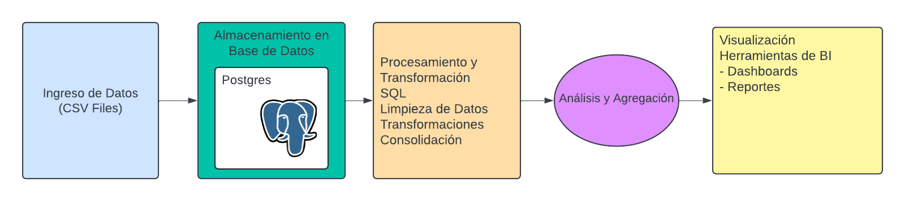

# RetoTecnico1-GADI

Este repositorio contiene un conjunto de herramientas desarrolladas en Python para el análisis y visualización de los portafolios de clientes en el ámbito de inversión, presentado como reto técnico por Sofía Salamanca. Estas herramientas están diseñadas para ayudar a los gerentes comerciales de inversión a gestionar de manera más eficiente los portafolios de sus clientes y tomar decisiones informadas basadas en datos. 

## Pipeline Analítico

El pipeline analítico desarrollado consta de los siguientes pasos:

 

1. **Ingreso de Datos**: Los datos se reciben en archivos CSV y se almacenan en una base de datos PostgreSQL.
2. **Procesamiento y Transformación**: Se realizan operaciones de limpieza, ajuste, transformación y consolidación de datos utilizando consultas SQL.
3. **Análisis y Agregación**: Se ejecutan cálculos adicionales utilizando Python para obtener insights sobre el portafolio de clientes.
4. **Visualización**: Los resultados se visualizan utilizando la biblioteca Dash de Python junto con Plotly para crear dashboards interactivos.

## Conclusiones Técnicas
- **Integración y automatización:**  Se ha demostrado que es posible integrar y automatizar el procesamiento de datos de diferentes fuentes utilizando SQL y Python.
- **Escalabilidad y flexibilidad:**  Usar PostgreSQL como base de datos le permite procesar grandes cantidades de datos de manera eficiente.  Implementar consultas SQL y administrarlas con Python proporciona una gran flexibilidad para realizar análisis complejos y específicos.
- **Eficiencia en el procesamiento de datos:**  Las transformaciones y cálculos realizados en SQL garantizan que los datos estén limpios y listos para un análisis posterior, lo que reduce el tiempo dedicado al procesamiento manual.  Una clara separación entre almacenamiento, procesamiento y visualización permite un mantenimiento más sencillo y actualizaciones más rápidas. 

## Conclusiones de Negocio

- **Visibilidad de la cartera**: El panel interactivo proporciona una imagen clara de la cartera de cada cliente, lo que ayuda a identificar oportunidades de inversión y reequilibrio.
- **Análisis de riesgos**: Ver su cartera por perfil de riesgo le permite evaluar rápidamente la alineación de sus inversiones con su perfil de riesgo deseado.

Con estas herramientas y análisis, los directivos empresariales pueden tomar decisiones más informadas y optimizar sus carteras de clientes de forma eficaz.
